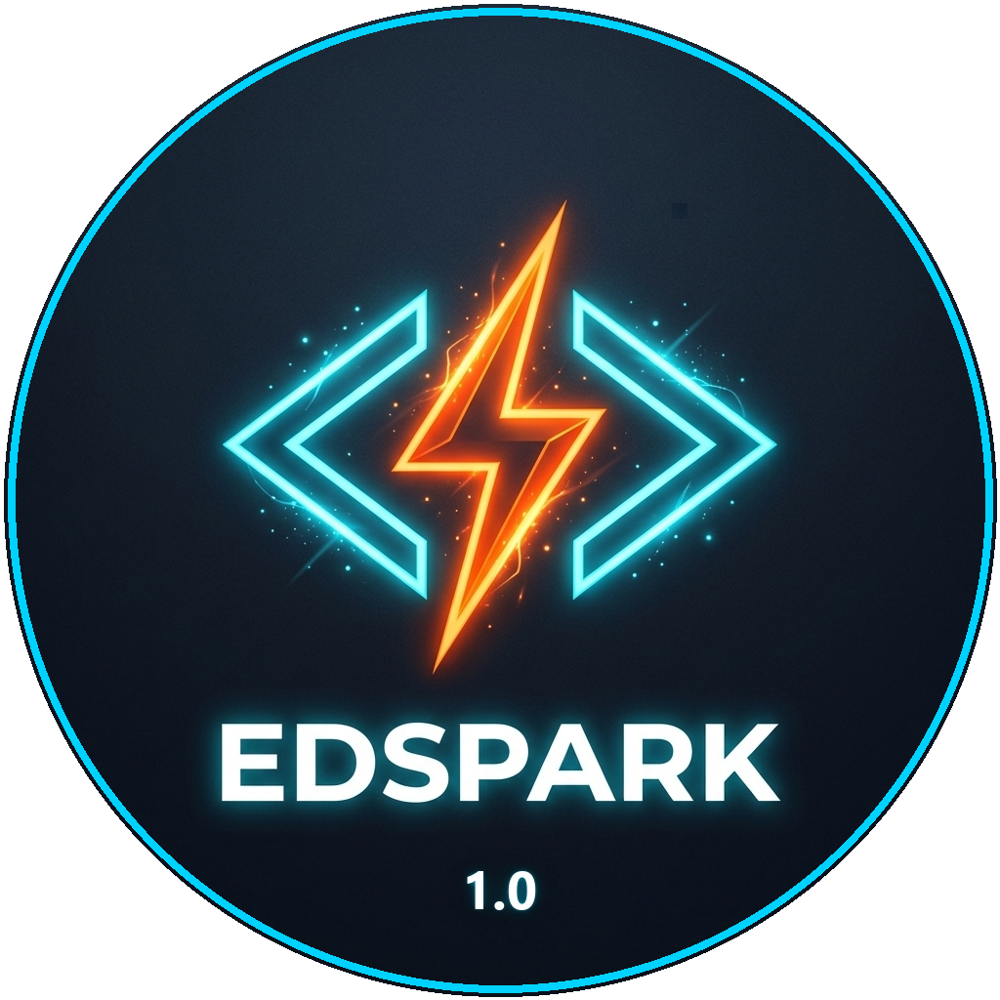

<p align="center">
  
</p>

<h1 align="center">⚡ EdSpark 1.0 — Web Development Webinar</h1>

<p align="center">
  🎓 <strong>Official Resource & Notes Repository for the College Web Development Webinar</strong><br/>
  <em>Organized by IEEE Education Society Student Branch Chapter</em>
</p>

<p align="center">
  
  
  
  
</p>


---

## 🎙️ Session Presenters

- 👨‍💻 **Lakshan M**
- 👩‍🏫 **Rifaath Fathimah S**
- 👩‍🏫 **Mythli R**

---

## 💻 Prerequisites & VS Code Setup

### 1. Install Visual Studio Code

Download and install Visual Studio Code for your operating system:

👉 [Visual Studio Code](https://code.visualstudio.com/)

### 2. Recommended VS Code Extensions

Open the **Extensions** panel in VS Code:

- Windows: `Ctrl + Shift + X`
- macOS: `Cmd + Shift + X`

| Extension | Author | Purpose |
| :--- | :--- | :--- |
| **Live Server** | *Ritwick Dey* | Live browser reload on code save |
| **Prettier - Code Formatter** | *Prettier* | Automatically formats HTML, CSS, and JavaScript |
| **Auto Rename Tag** | *Jun Han* | Automatically renames matching HTML tags |
| **CSS Peek** | *Pranay GP* | Quickly view and navigate to CSS rules |
| **JavaScript (ES6) Code Snippets** | *charalampos karypidis* | Useful JavaScript code snippets |

---

## 📚 Session Learning Tracks

### 1. HTML & CSS Track

- [`1_HTML.html`](./HTML_CSS/1_HTML.html) — Basic HTML tags, document structure, headings, paragraphs, and lists.
- [`1_CSS.html`](./HTML_CSS/1_CSS.html) — Introduction to CSS styling, colors, fonts, and selectors.
- [`2.html`](./HTML_CSS/2.html) — Box model, margins, padding, and borders.
- [`sample_site.html`](./HTML_CSS/sample_site.html) — **BitSpark Solutions** landing page layout.
- [`Sample.html`](./HTML_CSS/Sample.html) — **Travel Bucket List** responsive card-grid design.

### 2. JavaScript Track

- [`1.html` to `6.html`](./JS/) — Variables, operators, conditionals, functions, and events.
- [`8.html`](./JS/8.html) — 📝 **To-Do List App** *(add, complete, and delete tasks)*.
- [`9.HTML`](./JS/9.HTML) — 🛒 **Product Category Filter** *(dynamic UI filtering using JSON)*.

### 3. Reference Notes & Cheat Sheets

| Topic | Format | Resource |
| :--- | :---: | :--- |
| **Handwritten CSS Complete Notes** | 📄 PDF | [Download PDF](./Reference_Notes/CSS%20Notes/My%20CSS%20hand%20written.pdf) |
| **CSS Quick Cheat Sheet** | 🖼️ Image | [View Sheet](./Reference_Notes/CSS%20Notes/CSS_Cheat_Sheet.jpg) |
| **HTML Step-by-Step Module Notes** | 📁 Folder | [Open Folder](./Reference_Notes/HTML_Notes) |
| **JavaScript Quick Cheat Sheet** | 🖼️ Image | [View Sheet](./Reference_Notes/Java_Script/JS_Cheat_Sheet.jpeg) |
| **Full-Stack HTML/CSS/TS Cheat Sheet** | 🖼️ Image | [View Sheet](./Reference_Notes/%5BHTML,CSS,TS%5DCheat_Sheet.jpg) |

---

## 🛠️ Hands-on Projects

| Project | Technology | File |
| :--- | :--- | :--- |
| **Simple To-Do List** | HTML, CSS, JavaScript DOM | [`JS/8.html`](./JS/8.html) |
| **Dynamic Product Filter** | HTML, CSS, JSON | [`JS/9.HTML`](./JS/9.HTML) |
| **Travel Bucket List** | HTML5, CSS Grid, FontAwesome | [`HTML_CSS/Sample.html`](./HTML_CSS/Sample.html) |
| **BitSpark Landing Page** | HTML5, CSS Flexbox | [`HTML_CSS/sample_site.html`](./HTML_CSS/sample_site.html) |

---

## 🚀 How to Run Locally

### 1. Clone the Repository

```bash
git clone https://github.com/lakshan2906/EdSpark.git
cd EdSpark
```

### 2. Run the Projects

| Method | Instructions |
| :--- | :--- |
| 🌐 **Browser** | Double-click any `.html` file to preview it directly in your browser. |
| 💻 **VS Code** | Open the folder in VS Code, right-click an `.html` file, and select **"Open with Live Server"**. |

---

## 🌟 Repository Highlights

- 📖 Beginner-friendly learning resources
- 💻 Hands-on HTML, CSS & JavaScript examples
- 🛠️ Mini-projects for practical learning
- 📝 Reference notes and cheat sheets
- 🚀 Live-project-oriented workshop content

---

## ⭐ Support the Repository

If you found the **EdSpark** workshop and resources helpful, consider giving the repository a ⭐ **Star** on GitHub!

<div align="center">

### ⚡ Learn. Build. Create. Repeat.

**EdSpark — From Learning to Building.**

</div>
